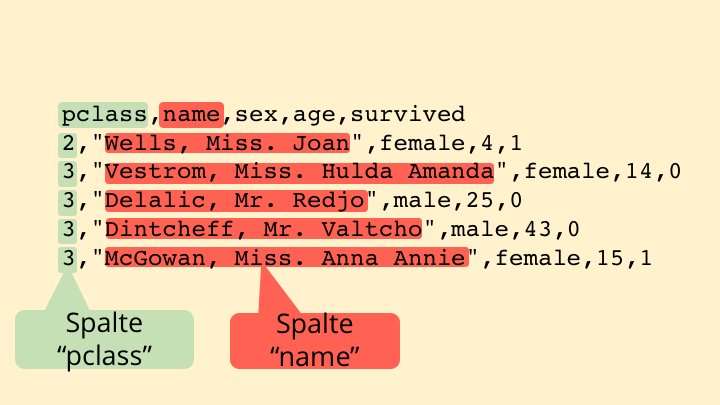

```{r setup, include=FALSE}
knitr::opts_chunk$set(echo = TRUE, warnings = FALSE, message = FALSE, eval = FALSE, cache = FALSE, fig.align = 'center')
```

# Preface

## Installation

In diesem Kurs werden wir mit R und RStudio als Programmierumgebung (IDE) arbeiten. 
Beide Programme stehen kostenlos zur Verfügung. 

Zunächst muss die Programmiersprache R installiert werden. 
Die aktuelle Version kann auf der offiziellen R-Website heruntergeladen werden (http://www.r-project.org)

Danach kann RStudio installiert werden, welches unter der Open Source Lizenz kostenlos zur Verfügung steht (https://www.rstudio.com/products/rstudio/download/).

## Warum R?

R hat eine steile Lernkurve und häufig fällt der Einstieg ohne Ausbildung zum Informatiker oder "Computer Scientist".
Jedoch zahlt sich das Lernen für Personen aus, die in der Wissenschaft arbeiten.

Welche Vorteile bieten Programmiersprachen im Vergleich zu den Statistiksoftwaretools wie SPSS und SAS?

- Kostenlos mit vielen Erweiterungen und Unterstützung einer breiten R-Nutzergruppe (z.B. auf Stackoverflow)
- Dokumentation durch Computer Code
- Reproduzierbarkeit der Analysen
- Möglichkeit fremde Pakete zu nutzten oder eigene Pakete zu schreiben um eigenen Arbeits- und Analyseprozesse zu standardisieren.

- R ist auch ein Werkzeug bzw. ein Werkzeugkoffer, um "Statistik" zu verstehen und neue statistische Konzepte zu lernen.

## R Studio

- Programmeinführung R-Studio

  - Dokumentation
  - Umgebung (Enironment)
  - Konsole

## Lern-Ressourcen und Materialien

- [stackoverflow.com](www.stackoverflow.com)  Online Forum, ein Fragesteller stellt eine Frage und jemand antwortet. Antworten können von anderen Nutzern bewertet werden
- R for Data Science (im Internet frei verfügbar)
- Twitter (z.B. [@hadlywickham](www.twitter.com(hadlywickham), [@rdpeng](https://twitter.com/rdpeng)))
- [DataCamp](www.datacamp.com), [Udemy](www.udemy.com) (Kostenpflichtige eLearning Platformen im Bereich statistisches Programmieren und Data Science)
- kostenfreie Online-Lern Angebote auf Youtube z.B. [MarinStatsLectures](https://www.youtube.com/playlist?list=PLqzoL9-eJTNBDdKgJgJzaQcY6OXmsXAHU)
- [Oft existieren für bestimmte Probleme sogenannte CheatSheets bzw. Spickzettel, welche die wichtigsten Kommandos zusammenfassen](https://www.rstudio.com/resources/cheatsheets/)

# Kapitel 1 - Datenstrukturen

## Einstieg in die Konsole und Datentypen

Vorab wichtig: R ist CaseSensitive, dass heißt, Groß- und Kleinbuchstaben sind unterschiedliche Zeichen.  Der Großbuchstabe `X` ist demnach nicht das selbe wie der Kleinbuchstabe x. Im R-Code werden daher zum Beispiel Variablennamen `x_mean` und `X_mean` unterschiedlich interpretiert.

* Datentypen (Numerisch, Integer, String, Faktoren, Boolean)
  * Integer (Ganzzahl) z.B. `100`
  * Numerisch (Float, Kommazahl) `0.12` oder Ratio zweier Integer `1/10` 
  * Boolean `TRUE` or `FALSE` (oder entprechend 1 und 0), werden in R als Datentyp `logical` bezeichnet
  * Zeichenkette, String `"Dies ist eine Zeichenkette"`
  
  * Datetime Datentyp (z.B. `as.Date("2017-05-05")`, hier ist die Funktionseingabe eine Zeichenkette in einer bestimmten Reihenfolge Jahr-Monat-Tag)
  
  * Besondere Datenwerte sind fehlende Werte z.B. `NA` (Not available) oder `NaN` (Not a Number z.B. `log(-10)`)
  * `NULL` Wert
  
Zum Überprüfen des Datentyps gibt es verschiedene Funktionen z.B. `is.character()`, `is.numeric()` oder `is.logical()`
  
* (Build-In) Funktionen 
  * z.B. `abs()`, `sqrt()`, `nchar()`, `mean()`
  * Dokumentation `?abs`
  * Funktions-Parameter 
  
* Erstellen und Nutzten von Datenstrukturen ("Objekte" und "Klassen")

  * Vektoren `c()`
  * Liste: `list()`
  * data.frame `data.frame()`
  
Es gibt noch weitere Datentypen, wie z.B. Matrix oder umfangreichere Strukturen wie z.B. Lineare Regressionsmodelle 
Da R Methoden für das objekt-orientierte Programmieren anbietet, können auch eigene Datenstrukturen entwickelt und genutzt werden.

## R als Taschenrechner (Kennenlernen der Konsole)

Wir können mathematische Operationen mit der R-Konsole berechen.

```{r, eval = FALSE}
1 + 1 # 2
1 - 1 # 0
2 * 4 # 8
2 / 4 # 1/2 oder .5

1 + 1/2
1 / 1  + 2
sqrt(9) + 3
sqrt(2)^2

```

In R ist es üblich Ergebnisse in einer Variable zu speichern.
Das ist mit einem "Pfeil"" als Zuweisungsoperator `<-` (ein kleiner als Zeichen gefolgt von einem Minuszeichen) möglich.
Auch `=` ist möglich, in R aber unüblich.

Zum Beispiel kann die Summe aus der ersten Berechnung in einer Variablen `x` und die Summe aus Berechnung zwei in `y` gespeichert werden.

`x <- 1 + 1` und `y <- 2 * 4`, wobei x und y die Ergebnisse der Berechnung in Form eines numerischen Datentyps (s.u) speichern.

`x + y` repräsentiert somit `(1 + 1) + (2 * 4)` bzw. `2 + 8`. 
R beachtet dabei Rechenregeln wie beispielsweise das Kommutativgesetzt oder das Assoziativgesetz.

## Arbeiten mit Vektoren

Durchschnittlich Temperaturen in den kommenden sieben Tagen.

```{r vektoren-funktionen}
# Erstellen eines Vektors
# Temperatur
# Daten aus Goolge https://www.google.com/search?q=google+wetter&ie=utf-8&oe=utf-8&client=firefox-b-ab 
# Suche am 19.4.2017
temperaturen <- c(27, 27, 22, 24, 13, 13, 13, 12)

# Was ist die höchste bzw. die kleinste Temperatur?
max_temp <- max(temperaturen)
min_temp <- min(temperaturen)
paste("Der wärmste Tag wird", max_temp, "Grad Celsius warm. Die kälteste", min_temp, "Grad Celsius.")

median(temperaturen) # Berechnen des Medians

# Extra Informationen: 
# Da der Median das 50% Quantil ist, kann dieser auch durch die Funktion `quantile` berechnet werden
# Diese Funktion erwartet zwei Argumente:
# Einen Vektor, der die Daten bzw. die Variable beinhaltet
# Zudem einen Vektor der die zu berechnenden Quantile beinhaltet
# Nähere Informationen durch `?quantile`
quantile(x = temperaturen, probs = c(.5)) # Das zweite Argument enthalt nur einen Wert (.5), da wir ausschließlich den Median errechnen möchten

```

## Eigenschaften von Vektoren

- Vektoren Recycling
- Vektorisierte Operationen

Beispiele für vektorisierte Operationen

```{r}
# Messgerät unterschätzt jede Messung um einen Grad
temperaturen_unbiased <- temperaturen + 1

# Messgerät ist falsch kalibriert und überschätzt mit steigender Temperatur 
# die tatsächliche Temperatur (um 10%)
temperaturen * .9

```

<div class="task">
<p class="task">
**Aufgabe:** 

Rechne die Temperaturen die im Vektor *temperaturen* gespeichert sind in die Einheit Fahrenheit um.

Dazu muss die Temperatur in Celsius mit 5/9 multipliziert und zu dieser Größe 32 addiert werden.

</p>
</div>


# Kapitel 2 - Funktionen


## Anwendungsbeispiel Mittelwert

```{r funktionen-definieren}

# Mittelwert
mittelwert <- function(x) {
  n <- length(x) 
  sum_x <- sum(x)
  sum_x / n
}

```

<div class="task">
**Aufgabe**

Erstellen Sie eine Funktion um die (empirische) Standardabweichung zu berechnen die wie in der folgenden Funktion definiert ist.

$\sigma =\sqrt{\frac{1}{n-1}\cdot {\sum\limits_{i=1}^n}  (x_i-\bar{x})^2}$

* Die Standardabweichung ist definiert als Wurzel des Mittelwerts folgender Größe: 
Der Summe der quadrierten Abweichung jedes Datenpunktes vom Mittelwert (SAQ).*

Folgende Funktionen sind nützlich für die Erstellung dieser Funktion:

- `length` die Länge des Vektors
- `sum` Summe eines Vektors
-  `x^2` Quadiert die Inhalte des Vektors `x`

Die (empirische) Standardabweichung beschreibt die Streuung einer Zufallsvariable.
Je größer die Standardabweichung desto wahrscheinlich sind Datenpunkte, die eine höhere Distanz zum Mittelwert haben.

```{r funktionen-schreiben}

source("code/temperaturen.R")
# Standardabweichung
standardabweichung <- function(x) {
  ??
  ??
}

standardabweichung(temperaturen) 
# Je kleiner die Standardabweichung, desto konstanter ist das Wetter in diesen Acht Tagen

```

</div>

<div class="task">

## Aufgabe

Recherchiere bei Google die Temperaturen der kommenden Tage für Moskau und Los Angeles.
Es werden bei Google das Wetter für den aktuellen Tag und der folgenden Woche angegeben.

Schreib eine Funktion mit dem Namen `wettervorhersage`.
Diese Funktion hat einen Parameter (oder auch Funktionsargument genannt).
Dieser Parameter ist ein numerischer Vektor (mit der Temperatur der kommenden Tage).

Die Funktion soll die kleinste und die höchste Temperatur berechnen sowie die Standardabweichung und die Informationen als String zurück geben. 

In welcher Stadt ist besseres Wetter, wo ist das Wetter konstanter?

```{r, eval=F}

wettervorhersage <- function(???) {
  ???
}

temperaturen_la <- ???
temperaturen_moskau <- ???
  
# print(temperaturen_la)
# print(temperaturen_moskau)
  
```

</div>

# Kapitel 3 - Datensatz


## Arbeiten mit Listen und data.frames 

Ist eine Sammlung verschiedener Datentypen.

Erstellen von Listen durch die Funktion `list()`.

```{r}
# In einem Vektor müssen die Elemente den gleichen Datentyp haben
# Welcher Datentyp besitzt der folgende Vektor?
c("A", 2)

# Die Liste muss nicht die selben Datentypen beinhalten (in Gegensatz zu einem Vektor)
# Beispielliste mit zwei Einträgen
beispielliste <- list(1, "B")

# Wir können auch Vektoren als Listenelemente speichern 
temperaturen_liste <- list(temperaturen_la, temperaturen_moskau)

# Wir können sogar Funktionen in Listen speichern 
# Und wem das nicht genug ist, der speichert einfach eine Liste in einer Liste ;)
sinnlosse_beispielliste <- list(beispielliste, standardabweichung)
str(sinnlosse_beispielliste)

```

## Datensatz aka data.frame 

Der `data.frame`ist eine besondere Form der Liste.
Er enthält $j$ Vektoren der selben Länge $n$.

```{r}
temperaturen <- data.frame(temperaturen_la, temperaturen_moskau)

# Mit verschiedenen Funktionen können wir den Datensatz darstellen
nrow(temperaturen) # Anzahl der Zeilen des Datensatzes
ncol(temperaturen) # Anzahl der Spalten des Datensatzes
dim(temperaturen) # Anzahl der Zeilen und Spalten 
str(temperaturen) # Struktur des Datensates
head(temperaturen, n = 2) # Zwei Funktionsargumente, n ist die Anzahl der Zeilen, welche angezeigt werden sollen
tail(temperaturen, n = 2) 
colnames(temperaturen) # Spaltennamen
class(temperaturen) # Klasse des Objekts (in diesem Fall `data.frame`)

```

## Operationen mit Datensätzen (data.frames)

Oft möchte man nur mit Ausschnitten des Datensatzes arbeiten.
R bietet die Möglichkeit einzelne Spalten (Variablen) des Datensatzes auszuwählen sowie einzelne Zeilen auszuwählen.
Für unseren Datensatz mit den Temperaturen könnten wir z.B. ausschließlich die Temperaturen für das Wochenende und nur für Los Angeles auswählen.

Es gibt mehrere Möglichkeiten, eine Auswahl eines Datensatzes zu erzeugen. 
Wenn wir einzelne Spalten eines Datensatzes auswählen möchten, eignet sich die `$`(Dollar)-Notation.
Dabei wird über den Datensatznamen und den Spaltennamen, die durch ein `$` verknüft werden auf die spezielle Spalte zugegriffen:
`datensatz_name$spaltenname`
Wenn wir auf die Spalte `temperaturen_la` unseres Datensatzes `temperaturen` zugreifen wolle, könnten wir dieses durch den Befehl `temperaturen$temperaturen_la`

In diesem Fall ist das Ergebnis ein Vektor mit den Daten aus der abgefragten Spalte `temperaturen_la`.

Die `$`-Notation ermöglicht es uns nicht nur, auf einzelne Spalten zurückzugreifen, sondern auch neue Spalten zu erstellen.

```{r, eval=F}
data.frame$neue_spalte <- x 
# wobei x ein Vektor mit neuen Daten ist, z.B. das Datum der entsprechenden Tage 

temperaturen$temperaturen_kairo <- c(36, 35, 37, 37, 36, 35, 34, 34)

```

## Importieren eines Datensatzes

{width=45%}
{width=45%}

Der Datensatz, in R als `data.frame` bezeichnet, ist eine zentrale Datenstruktur, die bei Datenanalysen zum Einsatz kommt.
Viele Datensätze sind so formatiert, dass sie direkt in R importiert werden können. 
So können zum Beispiel `data.frames` aus Excel, SPSS oder SAS direkt importiert werden.

Häufig liegen diese Daten jedoch in Textdateien im CSV-Format vor. CSV steht für Komma-separierte-Werte (engl. comma-separated-values).
Mit Hilfe der Funktion `read.csv` können Dateien im CSV-Format in R eingelesen werden.

Wir verwenden in diesem Tutorial den [Titanic Datensatz](https://www.kaggle.com/c/titanic).


```{r}

titanic <- read.csv("data/titanic.csv")

library(tidyverse)
head(titanic)

```

Diese spezielle R-Syntax erlaubt es, auf einzelne Spalten eines Datensatzes zuzugreifen.

Eine weitere Möglichkeit auf eine Auswahl des Datensatzes zist die sogenannten `[`-Notation, wobei `[` als "bracket" oder "Eckige Klammer" bezeichnet wird.
Diese hat folgende Syntax: `datensatz[zeilenfilter, vektor mit den spaltennamen]`.
`datensatz` bezeichnet den Namen des spezifischen Datensatzes, unser erstellter Datensatz hat den Namen.
In die folgenden eckigen Klammern wird die Auswahl des Datensatzes spezifiziert.
Vor dem Komma wird der Zeilenfilter gesetzt, nach der Klammer ein `character` Vektor, der die Namen der ausgewählten Spalten enthält.
Das Resultat ist ein neuer Datensatz, ausschließlich mit den Zeilen und Spalten, die ausgewählt wurden. 

## Auswählen von Zeilen und Spalten

```{r auswaehlen, eval = FALSE}

titanic[, "age"] # Nur Spalte Age
titanic[1, ] # Nur erste Zeile
titanic[c(1, 2), c("age", "sex")] # gibt die ersten beiden Zeilen und die Spalten Alter und Geschlecht wieder
titanic[titanic$age <= 18, ] # gibt die ersten beiden Zeilen und die Spalten Alter und Geschlecht wieder
titanic[titanic$sex == "male", ] # gibt die ersten beiden Zeilen und die Spalten Alter und Geschlecht wieder

```

**Cave: Oben habe ich geschrieben, das Ergebnis sei eine neuer Datensatz, also ein R-Objekt des Typs `data.frame´.
Wenn nur eine Spalte ausgewählt wird, ist das Ergebnis ein Vektor**

<div class="task">

**Aufgabe**

- Wie viele Passagiere waren auf der Reise unter 18 Jahre alt?
- Was ist das durchschnittliche Alter der Männer und der Frauen? 
- Wie hoch ist der durchschnittliche Ticktpreis (`fare`-Spalte)

</div>

# Kapitel 4 - Tidyverse

## Nutzen von Paketen

Bisher haben wir uns mit den Standardfunktionen von R befasst.
Zudem haben wir eine Funktions selber geschrieben.

Häufig entwickeln Statistiker und Programmierer Erweiterungen, die auch Pakete genannt werden, die wir als sogenannte `library` nutzten können.

Eine der zentralen Erweiterungen in R momentan ist das Paket `tidyverse`.
Es erweitert den Funktionsumfang von data.frames. 
Diese weiterentwickelte data.frame wir auch als `tibble` bezeichnet.

Pakete wie `tidyverse` müssen zusätzlich installiert werden.
Dies gelingt durch die Funktion `install.packages` z.B. `install.package(tidyverse)`.

Um das Paket zu nutzten müssen wir es zunächst laden.
Dies gelingt durch den Funktionsaufruf `library(tidyverse)`.

## Importieren von Daten

Auch Tidyverse-Paket hat eine Funktion, um Daten im CSV-Formtat zu importieren (und auch zu exportieren). 
Diese Funktion hat den Vorteil, dass sie die Daten schneller liest und den Datentyp einzelner Spalten zuverlässiger erkennt.

Die Funktion heißt `read_csv` (nicht verwechseln mit der Funktion `read.csv` die mit einem Punkt geschrieben wird).
Die Dokumentation erhalten wir durch `?read_csv`.


```{r}
library(tidyverse)
titanic <- read_csv("data/titanic.csv")
```

Es existieren in R Erweiterung die Schnittstellen und Importmöglichkeiten für andere Datenformate bieten:

- SPSS `haven::read_sav(file = "data/titanic.sav")`
- Excel `read::read_xlsx(file = "data/titanic.xlsx")`

<div class="task">
**Aufgabe** 

Nutzen sie die beiden Funktionen um den Datensatz als data.frame zu importieren. 
Speichern Sie den jeweiligen Datensatz in einer Variable.

Berechnen Sie den Mittelwert des Alters und vergleichen Sie die Ergebnisse.

```{r}
# einlesen des SPSS Datensatzes mit dem haven Paket
titanic_sav <- ???

# einlesen des Excel Datensatzes
titanic_xlsx <- ???

# Berechnen der Mittelwerte des Alters in der Spalte `age`  

```

</div>

## Arbeiten mit dem tidyverse

Das tidyverse bedient sich einer einfachen Syntax und 5 zentralen Funktionen.
Das besondere der Syntax ist das aneinanderreihen von (tidyverse) Funktionen.
Der Pipe-Operator verbindet Funktionen und gibt den Funktionsoutput der vorangegangenen Funktion in die folgende Funktion als Funktionsinput weiter.
Der Pipe Operator wird mit der Syntax `%>%` (Prozentzeichen, größer-Zeichen, Prozentzeichen) verwendet.
Fast alle Funktionen im tidyverse erwarten einen `data.frame` als Funktionsinput und geben einen manipulierten `data.frame` zurück.

Die fünf zentralen Funktionen sind Verben, die ausdrücken, was die jeweilige Funktion "tut".


#### Beispiele

*Umrechnung der Fahrpreises*

```{r}
titanic %>% 
  mutate(fare = fare * 11.25) %>%
  arrange(fare) %>% tail
```


*Die ältesten 3 überlebenden Passagiere*

```{r}

titanic %>% 
  mutate(survived = if_else(survived == 1, TRUE, FALSE)) %>% 
  filter(survived) %>% 
  select(name, age, pclass) %>% 
  arrange(age) %>% 
  tail(n = 3)

```

<div class="task">

**Aufgabe**

Welche Passagiere haben den Höchsten Preis für die Reise bezahlt?

Geben Sie den Namen und den Fahrpreis in der finale Tablle aus.

```{r}
titanic %>% 
  select(???) %>% 
  ... %>% 
  head(n = 10)

```

[Extrainfos](https://www.encyclopedia-titanica.org/titanic-survivor/thomas-cardeza.html)

</div>

*Was ist das durchschnittliche Alter der Passagiere?*

- Zusammenfassen durch den Mittelwert - `summarise`

```{r}

titanic %>% 
  summarise(age_mean = mean(age, na.rm = T))

```

*Was ist das durchschnittliche Alter der männlichen und weiblichen Passagiere und was ist die Standardabeichung des Alters?*

- Gruppen erstellen entsprechend des Geschlechts - `group_by`
- Zusammenfassen durch den Mittelwert - `summarise`

```{r}
titanic %>% 
  group_by(sex) %>% 
  summarise(age_mean = mean(age, na.rm = T), age_sd = sd(age, na.rm = T), n = n())
```

<div class="task">

**Aufgabe**

Was ist der durchschnittliche Fahrpreis und die jeweilige Streuung für die jeweiligen Klassen?


```{r}
titanic %>% 
  ...  
 
```
</div>


<div class="task">
**Aufgabe**

Der *New York Herold* titelte am 15.April 1912: *The Titanic sinks with 1800 on board; only 675 mostly women and children, saved*.

Finden sie heraus, ob diese Schlagzeile aus den Daten nachvollziehbar ist, indem Sie die Funktionen des `tidyverse` anwenden.

```{r}
titanic %>% 
  
```


</div>

<div class="task">

**Aufgabe**

Es ist bekannt dass die Rettungsoote auf der Titanic nicht ausgelastet waren.
Nun sollen Sie die tatsächliche Auslasung der Rettungsboote auf der Titanic berechnen.

Die Informationen ob und in welches Rettungsboot ein Gast bestieg ist in der Spalte `boat` des Titanic Datensatzes vermerkt.

```{r}
titanic %>% 
 ??? 
  
```

</div>


# Rückblick und Ausblick

- Vom elementaren Datentyp über Vektoren zu Listen und data.frames
- `data.frames` stellen das zentrale Datenelement im tidyverse dar
- Das `tidyverse` ist der Werkzeigkasten in  R zur Datenmanipulation

- Weiter wichtige Funktionen z.B. aus der Inferenzstatistik sind in R vorhanden z.B. `?t.test`
- Ein großer Funktionsumfrang zum Modellieren von Daten z.B. von Lineare Regression bis zur Neuronalen Netzen


Weitere statistische Operationen wie z.B. Konfidenzintervalle und Inferenzstatistik (t.tests)

```{r}
titanic %>% 
  group_by(sex) %>% 
  filter(age >= 18) %>% 
  summarise(ci = list(Hmisc::smean.cl.boot(age))) %>% 
  mutate_at("ci", ~ map(.x, enframe)) %>% 
  unnest(ci) %>% 
  spread(key = name, value = value)
```


<hr>

```{r}
titanic <- read.csv("data/titanic.csv")

titanic %>% 
  ggplot(aes(x = factor(pclass), y = fare)) + 
  stat_summary(fun.data = mean_cl_boot, geom = "errorbar", width = .15, size = 1.25) + 
  stat_summary(fun.y = mean, geom = "point", size = 2) +
  geom_point(alpha = .05) +
  ylab("Fahrpreis in Dollar (1912)") +
  scale_x_discrete(labels = c("1. Klasse", "2. Klasse", "3. Klasse")) +
  scale_y_continuous(label = scales::dollar_format(), breaks = seq(0, 120, by = 20), limits = c(0, 120)) +
  theme_bw() +
  theme(axis.title.x = element_blank(), 
        axis.text = element_text(size = 12))

train <- titanic %>% select(survived, sex, age, pclass)
decision_tree <- rpart(survived ~ .,
                 data = train,
                 method ="class")


fancyRpartPlot(decision_tree, main = "", sub = "Welche Personen haben den Titanic-Untergang überlebt?")

```

